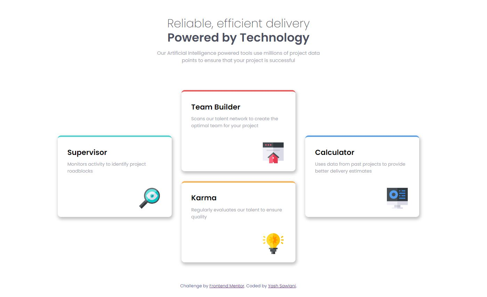

# Frontend Mentor - Four card feature section solution

This is a solution to the [Four card feature section challenge on Frontend Mentor](https://www.frontendmentor.io/challenges/four-card-feature-section-weK1eFYK). Frontend Mentor challenges help you improve your coding skills by building realistic projects. 

## Table of contents

- [Overview](#overview)
  - [The challenge](#the-challenge)
  - [Screenshot](#screenshot)
  - [Links](#links)
- [My process](#my-process)
  - [Built with](#built-with)
  - [What I learned](#what-i-learned)
- [Author](#author)

## Overview

### The challenge

Users should be able to:

- View the optimal layout depending on their device's screen size
- See hover states for interactive elements

### Screenshot

### Links

- Solution URL: [Github](https://github.com/Yash846/4-Card-Feature-Frontend-Mentor)
- Live Site URL: [Live Site](https://4-card-feature.netlify.app/)

## My process

- Created HTML markup of the page using appropriate tags.
- Styled the components in CSS using Flexbox.
- Added @media query to finalize the mobile layout.
- Hosted on netlify and submitted the solution

### Built with

- Semantic HTML5 markup
- CSS custom properties
- Flexbox
- CSS Grid

### What I learned

- Write a responsive CSS.
- Use and application of Flexbox.

## Author

- LinkedIn - [Yash Sawlani](https://www.linkedin.com/in/yash-sawlani/)
- Frontend Mentor - [@Yash846](https://www.frontendmentor.io/profile/Yash846)
- GitHub - [@Yash846](https://github.com/Yash846)